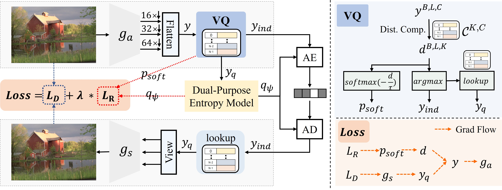
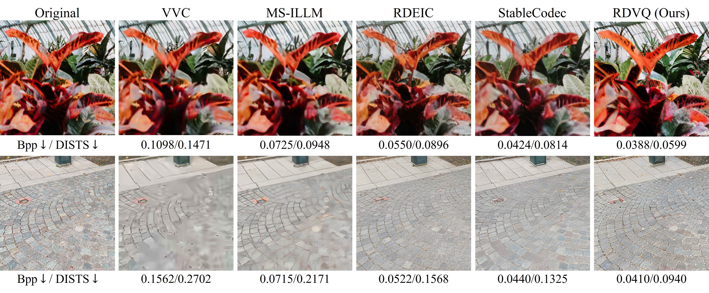
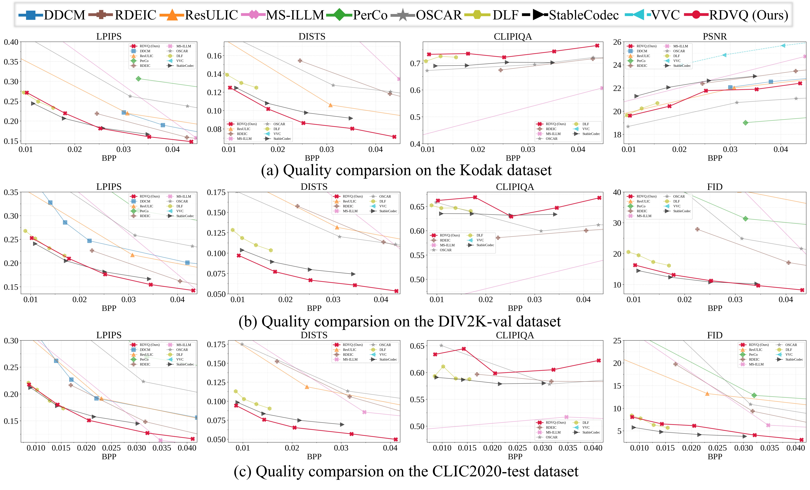

## Differentiable Vector Quantization for Rate-Distortion Optimization of Generative Image Compression (CVPR 2026)


<div align="center">

[Shiyin Jiang](https://scholar.google.com/citations?user=yf748WAAAAAJ&hl=en), [Wei Long](https://scholar.google.com/citations?user=CsVTBJoAAAAJ&hl=en), Minghao Han, [Zhenghao Chen](https://scholar.google.com/citations?user=BThVCu8AAAAJ&hl=en), [Ce Zhu](http://scholar.google.com/citations?hl=en&user=C7iZbYMAAAAJ), [Shuhang Gu](https://scholar.google.com/citations?user=-kSTt40AAAAJ&hl=en)

[](xxxx)&nbsp;



</div>

## 📝 Abstract
The rapid growth of visual data under stringent storage and bandwidth constraints makes extremely low-bitrate image compression increasingly important. While Vector Quantization (VQ) offers strong structural fidelity, existing methods lack a principled mechanism for joint rate-distortion (RD) optimization due to the disconnect between representation learning and entropy modeling.
We propose RDVQ, a unified framework that enables end-to-end RD optimization for VQ-based compression via a differentiable relaxation of the codebook distribution, allowing the entropy loss to directly shape the latent prior. We further develop an autoregressive entropy model that supports accurate entropy modeling and test-time rate control.
Extensive experiments demonstrate that RDVQ achieves strong performance at extremely low bitrates with a lightweight architecture, attaining competitive or superior perceptual quality with significantly fewer parameters. Compared with RDEIC, RDVQ reduces bitrate by up to 75.71\% on DISTS and 37.63\% on LPIPS on DIV2K-val. Beyond empirical gains, RDVQ introduces an entropy-constrained formulation of VQ, highlighting the potential for a more unified view of image tokenization and compression. The code is available at https://github.com/CVL-UESTC/RDVQ.

## 🚀 Performance

<p align="center">


<p>


## 🌿 Code will comming soon

## ⭐ Contact
If you have any questions about ECVC, please contact Shiyin Jiang (shiyin.jsy@gmail.com)

## BibTeX
```bibtex

```
