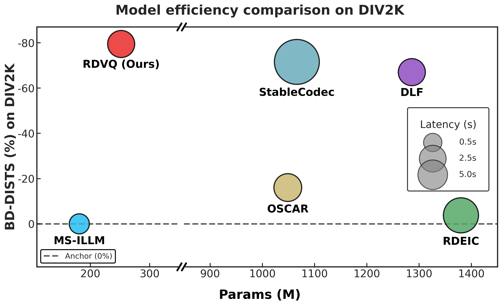

<div align="center">

# RDVQ: Differentiable Vector Quantization for Rate-Distortion Optimization of Generative Image Compression

### CVPR 2026 Oral

[](https://arxiv.org/abs/2604.10546)
[](https://cvpr.thecvf.com/)
[](LICENSE)

[Shiyin Jiang](https://scholar.google.com/citations?user=yf748WAAAAAJ&hl=en) ·
[Wei Long](https://scholar.google.com/citations?user=CsVTBJoAAAAJ&hl=en) ·
Minghao Han ·
[Zhenghao Chen](https://scholar.google.com/citations?user=BThVCu8AAAAJ&hl=en) ·
[Ce Zhu](http://scholar.google.com/citations?hl=en&user=C7iZbYMAAAAJ) ·
[Shuhang Gu](https://scholar.google.com/citations?user=-kSTt40AAAAJ&hl=en)

**CVL Lab @ University of Electronic Science and Technology of China**


</div>

---

## 🔥 News

* **Jun 12, 2026** — Training code and configurations are released.

---

## 🌟 Introduction

**RDVQ** is a VQ-based generative image compression framework for **efficient and controllable ultra-low-bitrate image compression**.

Conventional VQ-VAE learns powerful discrete representations, but its **non-differentiable nearest-neighbor lookup** decouples representation learning from probability modeling. The entropy model can only predict the resulting code indices, while its rate feedback cannot effectively optimize the encoder. This limits true joint rate-distortion optimization.

RDVQ addresses this issue with a **simple relaxed lookup mechanism**, which builds a differentiable path between encoder features, discrete code indices, and the autoregressive entropy model. As a result, the rate loss can directly guide the encoder to learn more compressible representations, transforming **VQ-VAE from a representation learning framework into a practical learned image codec**.

### Key Features

* **Differentiable VQ-based R-D optimization**
  Enables joint distortion and rate minimization through relaxed lookup.

* **Multi-scale shared-codebook latents**
  Provide compact and expressive discrete representations across scales.

* **Masked Transformer entropy model**
  Estimates accurate probabilities for effective entropy coding.

* **Test-time rate control**
  Supports bitrate adjustment via prefix transmission and autoregressive completion.

Despite its lightweight design, RDVQ achieves strong perceptual compression performance at ultra-low bitrates while requiring only a small fraction of the parameters used by large generative compression models.

---

## 🚀 Performance

### Model Efficiency

<p align="center">
  
</p>

### Visual Comparison

<p align="center">
  
</p>

### Rate-Distortion Curves

<p align="center">
  
</p>

---

## 🛠️ Environment Setup

```bash
conda create -n RDVQ python=3.10 -y
conda activate RDVQ

git clone https://github.com/CVL-UESTC/RDVQ.git
cd RDVQ

pip install "torch>=2.1.0" torchvision --index-url https://download.pytorch.org/whl/cu121
pip install -r requirements.txt
```

> **Note:** The default real-bitstream path uses the causal top-k tensor-rANS codec and JIT-builds a small C++17 extension on first use. Please make sure a C++17 compiler is available when running `test_real.sh`.

---

## 📂 Data Preparation

RDVQ expects an **ImageFolder-style** directory where all images are directly placed under one folder:

```text
/path/to/images/
  image_0001.png
  image_0002.jpg
  ...
```

Nested subdirectories are not scanned by the testing scripts.

---

## 🧪 Testing

We provide the pretrained checkpoints and testing weights at [Huggingface](https://huggingface.co/CVLUESTC/RDVQ/tree/main).

RDVQ provides two testing scripts:

| Script         | Bitrate Type           | Description                                           |
| -------------- | ---------------------- | ----------------------------------------------------- |
| `test_forward.sh`      | Estimated bitrate      | Reports entropy-estimated bitrate such as `cd_bpp`.   |
| `test_real.sh` | Real bitstream bitrate | Reports actual payload bitrate such as `cd_bpp_real`. |

By default, the evaluator reports:

```text
bpp, lpips, dists, musiq, clipiqa, niqe, psnr, msssim
```

You can override the metric list with `TEST_METRICS`.

### Quick Start: Estimated-Rate Evaluation

```bash
TEST_CKPT_PATH=/path/to/checkpoint \
TEST_IMAGE_DIR=/path/to/kodak \
TEST_DATASET=kodak \
bash test_forward.sh
```

### Quick Start: Real-Bitstream Evaluation

```bash
TEST_CKPT_PATH=/path/to/checkpoint \
TEST_IMAGE_DIR=/path/to/kodak \
TEST_DATASET=kodak \
bash test_real.sh
```

### DIV2K / CLIC Evaluation with FID and KID

For DIV2K and CLIC, please provide `FID_REF_ROOT`:

```bash
TEST_CKPT_PATH=/path/to/checkpoint \
TEST_IMAGE_DIR=/path/to/DIV2K_valid_HR \
TEST_DATASET=div2k \
FID_REF_ROOT=/path/to/fid_refs \
bash test_forward.sh
```

For CLIC:

```bash
TEST_CKPT_PATH=/path/to/checkpoint \
TEST_IMAGE_DIR=/path/to/CLIC_valid \
TEST_DATASET=clic \
FID_REF_ROOT=/path/to/fid_refs \
bash test_forward.sh
```

The evaluator uses:

```text
<FID_REF_ROOT>/<TEST_DATASET>_256teles
```

If the reference directory is missing or empty, it will be generated automatically from the original images and reused in later runs.

### Test-Time Rate Control

`test_real.sh` supports test-time rate control through prefix transmission and autoregressive completion by changing `TEST_TRANSFER_SLICES`:

```bash
TEST_CKPT_PATH=/path/to/checkpoint \
TEST_IMAGE_DIR=/path/to/kodak \
TEST_DATASET=kodak \
TEST_TRANSFER_SLICES=4 \
bash test_real.sh
```


### Useful Debug Options

```bash
TEST_MAX_IMAGES=1
TEST_METRICS=bpp,psnr,msssim
DISABLE_FID=1
SAVE_IMAGES=0
```

### Main Environment Variables

| Variable               | Required       | Description                                                          |
| ---------------------- | -------------- | -------------------------------------------------------------------- |
| `TEST_CKPT_PATH`       | Yes            | Path to the checkpoint.                                              |
| `TEST_IMAGE_DIR`       | Yes            | Image folder for evaluation.                                         |
| `TEST_DATASET`         | Yes            | Dataset label: `kodak`, `div2k`, or `clic`.                          |
| `FID_REF_ROOT`         | For DIV2K/CLIC | Root directory for FID/KID reference tiles.                          |
| `FID_REF_DIR`          | Optional       | Manually specified reference tile directory.                         |
| `TEST_METRICS`         | Optional       | Evaluation metric list.                                              |
| `TEST_TRANSFER_SLICES` | Optional       | Number of transmitted latent slices for real-bitstream rate control. |
| `TEST_TOPK`            | Optional       | Top-k/escape entropy width for `test_real.sh`. Default: `1024`.      |
| `TEST_MAX_IMAGES`      | Optional       | Maximum number of images for debugging.                              |
| `DISABLE_FID`          | Optional       | Disable FID/KID computation.                                         |
| `SAVE_IMAGES`          | Optional       | Whether to save reconstructed images.                                |

### Output Structure

```text
<checkpoint_stem>/forward/<dataset_name>/
<checkpoint_stem>/Real/transfer_slices_<N>/<dataset_name>/
```

---

## 🏋️ Training

Training follows a multi-stage pipeline. Please refer to [TRAINING_STAGES.md](TRAINING_STAGES.md) for the full recipe.

### Stage 1: Tokenizer Training

```bash
bash scripts/tokenizer/train_vq.sh \
  --data-path /path/to/train/images \
  --image-size 256 \
  --vq-model VQ-16-32-64_quant_once \
  --dataset openimage \
  --global-batch-size 32 \
  --results-dir ./results/s1_tokenizer \
  --codebook-size 4096 \
  --codebook-embed-dim 32 \
  --entropy-loss-ratio 0.0 \
  --lr 1e-4 \
  --disc-lr 1e-4 \
  --wo-attn
```

---

## 📖 Citation

If you find RDVQ helpful for your research, please cite:

```bibtex
@inproceedings{jiang2026rdvq,
  title={Differentiable Vector Quantization for Rate-Distortion Optimization of Generative Image Compression},
  author={Jiang, Shiyin and Long, Wei and Han, Minghao and Chen, Zhenghao and Zhu, Ce and Gu, Shuhang},
  booktitle={Proceedings of the IEEE/CVF Conference on Computer Vision and Pattern Recognition},
  pages={14440--14450},
  year={2026}
}
```

---

## 💬 Contact

For questions or feedback, please contact:

**Shiyin Jiang**
📧 **[shiyin.jsy@gmail.com](mailto:shiyin.jsy@gmail.com)**
